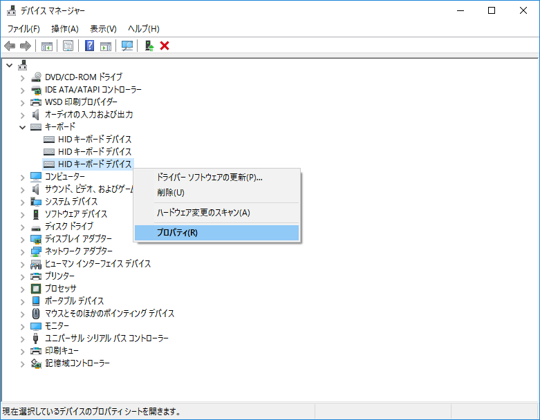
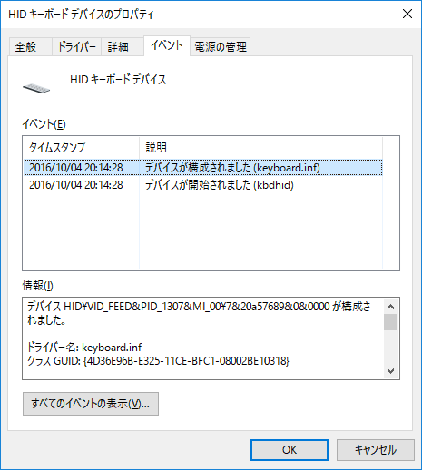
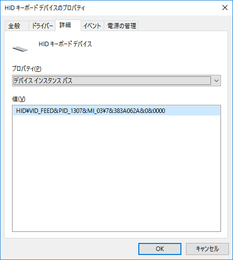
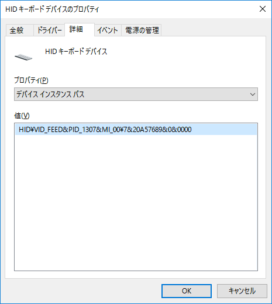
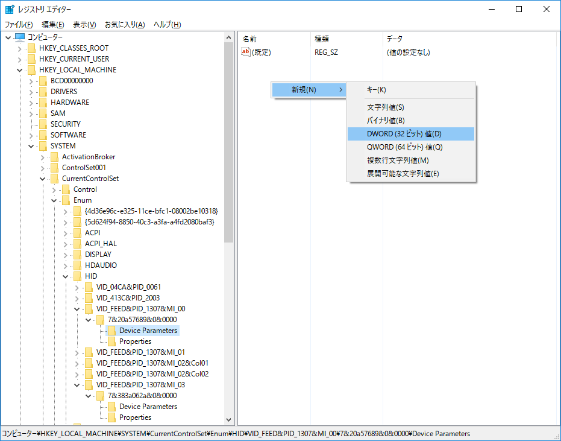

## ErgoDox EZ と Windows 日本語版

ErgoDox EZ を Windows の日本語版にキーボードを接続すると __JIS キーボード（日本語配列）__ として認識されます。そのことに問題があるわけではないのですが、公開されている ErgoDox の情報は __US キーボード（英語配列）__ として認識された上での説明となっていることがほとんどです。キーマッピング設定も英語配列がベースとなっています。

現状、どちらのキーボードとして認識されているかを確認するためには、適当なテキスト入力欄でキーボードの `Q` `W` キーの上にある `2` キーを `Shift` と同時に押します。現れた文字列が `"`（ダブルクォーテーション）であれば日本語配列、 `@` であれば英語配列です。

ここでは、 ErgoDox EZ を US キーボード（英語配列）として認識させるためにレジストリを変更して実現する方法を紹介します。

## デバイスマネージャーの確認

ErgoDox を接続すると、デバイスマネージャーのキーボード項目に「HID キーボードデバイス」が ==２つ== 追加されます。これは ErgoDox が２つに分かれているからですね。

「HID キーボードデバイス」が並んだのを見て、きっとあなたはこう思うでしょう。
『どれがどれだかわからない…』。
大丈夫です。プロパティを開き、 __イベントタブ__ を確認します。そうしたら、タイムスタンプから判別できることがわかるでしょう。右か左かは今回の件には関係ないので、タイムスタンプが同じペアを探します。
プロパティのダイアログは複数同時に開けます。

ErgoDox のペアを見つけたら、次は __詳細タブ__ のプルダウンから ==__デバイス インスタンスパス__== を選択し、値を確認できる状態で維持します。

## レジストリエディターでの編集（左右２デバイス分）

デバイス インスタンスパスの値に対応した項目を探します。

- `HKEY_LOCAL_MACHINE`
  - `SYSTEM`
    - `CurrentControlSet`
      - `Enum`
        - ==__デバイス インスタンスパス__==
          - `Device Parameters`

`Device Parameters` の内容を表示した状態で右側の何もないところで右クリックし、
==DWORD (32 ビット) 値 (D)== を選択して項目を追加します。追加するのは以下の２点です。

| 名前                    | 値 |
|-------------------------|:-:|
| KeyboardSubtypeOverride | 0 |
| KeyboardTypeOverride    | 4 |

==同様の操作を、もう片方のデバイスに対しても実施します。==

## 変更内容の反映

コンピュータを ==__再起動__== します。

再起動が済んだら、再び `2` キーを `Shift` と同時に押して `@` が表示されることを確認したら完了です。
