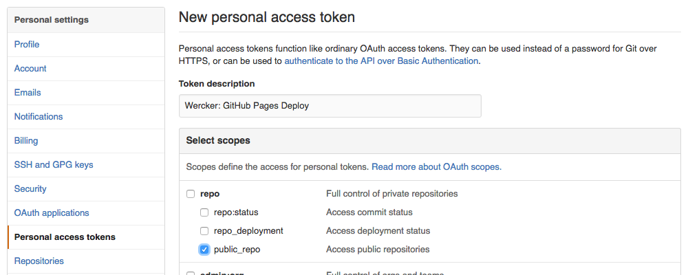
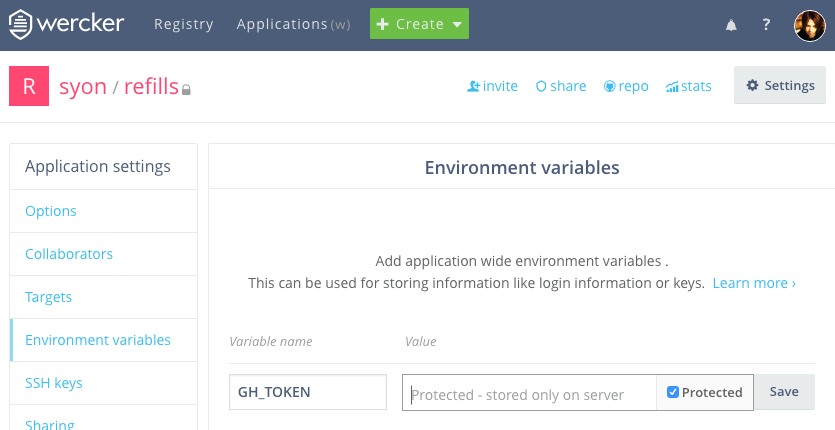

## GitHub アクセストークン

Wercker から GitHub Pages に自動デプロイするには [lukevivier/step-gh-pages](https://app.wercker.com/#applications/51f71ee369cd738a32001822/tab/details/) を使用することが慣例となっているようです。
これによる push を GitHub 側から許可するには、個人設定から public_repo 権限を与えたトークンを生成して渡す必要があります。

GitHub のアクセストークンの管理が個人設定にあることからもわかるように、リポジトリには直接紐付いてはいません。
そのため、Wercker で複数のリポジトリに対して GitHub Pages をデプロイする場合でも、
1つのトークンを使いまわすことで管理を一元化できます。

- [Personal Access Tokens](https://github.com/settings/tokens)
  - OAuth scopes: ✔ __public_repo__
  - [OAuth | GitHub Developer Guide](https://developer.github.com/v3/oauth/#scopes)




## Wercker の設定

GitHub で生成したトークンを、Wercker のアプリケーションの環境変数に設定します。
__Protected__ にチェックしてトークンを秘匿します。
これが wercker.yml の `$GH_TOKEN` に渡されてデプロイに利用されます。

- Wercker `>` Application settings `>` Environment variables
  - Variable name: `GH_TOKEN`
  - Value: <上記で生成したトークン> [ __✔ Protected__ ]



#### wercker.yml (抜粋)
```yaml
    - lukevivier/gh-pages:
        token: $GH_TOKEN
        basedir: harp-src/www/works
```
