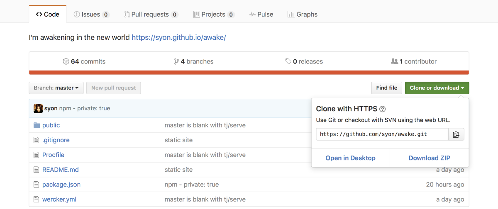
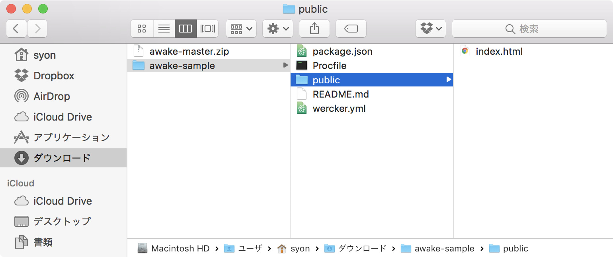
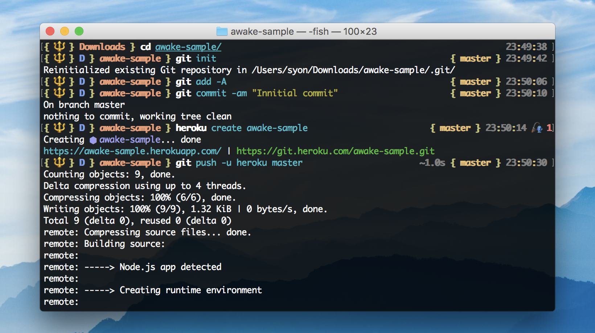
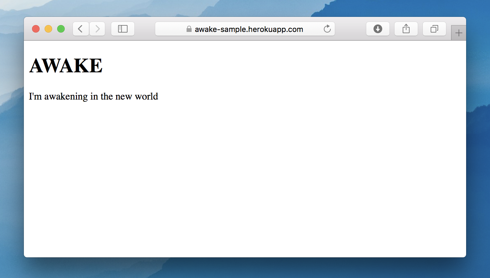

すでに手元にある HTML などのファイルをインターネットに公開したい場合に、
クラウドサービスを利用すると便利です。
今回は無料で利用できる Heroku を使ったやり方を紹介します。

- [Cloud Application Platform | Heroku](https://www.heroku.com/)

Heroku でアカウントを登録したら、コマンドラインで扱うために Heroku CLI をインストールします。

- [Heroku CLI \| Heroku Dev Center](https://devcenter.heroku.com/articles/heroku-cli)

インストールが完了したら、`$ heroku login` でログインします。


## ひな形をダウンロード



- https://github.com/syon/awake
  - Download ZIP

ダウンロードした ZIP ファイルを、任意の場所に展開します。
その後、ディレクトリ名を `awake` からサイト名に変更してください。
ここでは仮に `awake-sample` として説明していきます。指定する名称は公開先の
URL として https://awake-sample.herokuapp.com が得られます[^1]。



ちなみに `$ git clone` して利用することもできますが、あとで自分のリポジトリとして
Git 管理したり GitHub にプッシュしたい場合に面倒なので、こちらの方法を取るほうが手っ取り早いです。

[^1]: URL にこだわりがなければ、後述の `$ heroku create` コマンドで名称を未指定にすれば自動で生成されます。


## ターミナルで操作

まずはサンプルをそのままアップロードし、Heroku上で動作するかを確認しましょう。  
はじめに、Git 管理を開始して初期状態としてコミットします。

```bash
$ cd awake-sample
$ git init
$ git add -A
$ git commit -am "Innitial commit"
```

次に Heroku アプリを作成してプッシュ（アップロード）します。
`$ heroku open` はブラウザで公開先を開くコマンドです。

```bash
$ heroku create awake-sample
$ git push -u heroku master
$ heroku open
```





要領がわかったところで、お手元のファイルを `public` ディレクトリに配置します。  
変更内容をコミットして Heroku にアップロードして完了です。

```bash
$ git add -A
$ git commit -am "update"
$ git push -u heroku master
```


## ローカルで動作確認したいとき

動作に必要な Node.js のパッケージをインストールします。

```bash
$ npm install
```

HTTP サーバを起動してブラウザで確認します。

```bash
$ npm start
```

- http://localhost:5000

修正が必要になったら、そのまま `public` ディレクトリの内容を変更します。
反映されない場合は、ブラウザのキャッシュを確認してみてください。
HTTP サーバは `control + C` で停止します。


## Basic認証をかける

ユーザー名とパスワードを使ってWebサイトに閲覧制限をかけることができます。  
`Procfile` を以下のように編集します。

```bash
web: serve public --auth
```

変更内容をコミットします。

```bash
$ git commit -am "basic auth"
```

Herokuサーバに、Basic認証に使うユーザー名とパスワードを設定します。

```bash
$ heroku config:set SERVE_USER username
$ heroku config:set SERVE_PASSWORD password
```

リポジトリをHerokuに反映して完了です。

```bash
$ git push -u heroku master
```
