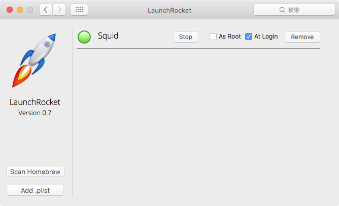

## Reload config
- [Reload Squid Proxy Server Without Restarting Squid Daemon](http://www.cyberciti.biz/faq/howto-linux-unix-bsd-appleosx-reload-squid-conf-file/)

`kill -HUP`だとうまく機能しなかった、`--help`も効かないのでそのうち調べる
```bash
$ kill $(cat /usr/local/var/run/squid.pid)
```
reload the squid after making changes to squid.conf file
```bash
$ /usr/local/sbin/squid -k reconfigure
```


## Black List / White List
- [squid で特定のサイトをアクセス拒否する](http://futuremix.org/2005/07/squid-access-deny)
- [squid で特定のサイトのみアクセスを許可する](http://futuremix.org/2005/07/squid-access-allow)
- [su – root » Blog Archive » squidでURLフィルタ](http://www.p-runner.net/wordpress/?p=275)


## Launch on Startup (OSX)



[jimbojsb/launchrocket](https://github.com/jimbojsb/launchrocket)
: A Mac PrefPane to manage all your Homebrew-installed services


## Memo
- `acl myaclname` で定義して `http_access allow myaclname` で利用
- `http_access` は上から評価され、マッチするとそこで切り上げる。  
  例えば allow localnet の下に allow password を記述しても、localnet 内の端末は常に許可される。
